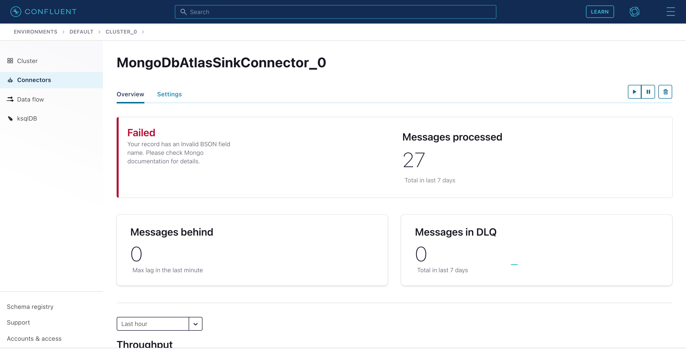

# Overview
  
Produce messages to and consume messages from a Kafka cluster using [Confluent Python Client for Apache Kafka](https://github.com/confluentinc/confluent-kafka-python).

# Source Documentation

You can find the documentation and instructions for running this Python example at [https://docs.confluent.io/platform/current/tutorials/examples/clients/docs/python.html](https://docs.confluent.io/platform/current/tutorials/examples/clients/docs/python.html?utm_source=github&utm_medium=demo&utm_campaign=ch.examples_type.community_content.clients-ccloud)

# Error 
Your record has an Invalid BSON field name. Please check Mongo documentation for details.

# Schema samples
{"timestamp":{"$date":"2021-08-09T01:24:43.000Z"},"reg_num":"Genetta genetta","lat":41.2860336,"lon":19.8905149}
{"timestamp":{"$date":"2021-08-09T01:50:24.000Z"},"reg_num":"Lamprotornis nitens","lat":57.7197857,"lon":12.933356}

## Error screenshots 

